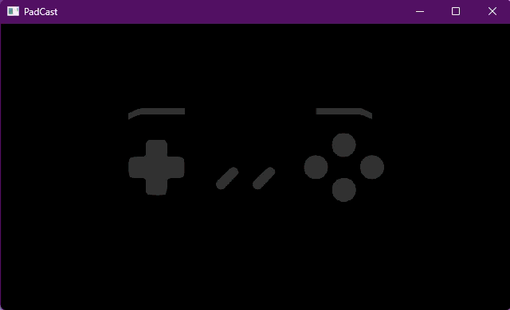

# PadCast
### A simple gamepad display that shows controller activity. Geared towards streamers.
---


Work in progress! So far supports (any?) controller that matches the configuration
you see in the image above.

Written in C++ and is light on resources.

---

Current features:
- Can change FPS to 30, 60, 90, 120 (or set custom FPS in config.ini)
- Can change background color. Can set custom background color in config/config.ini file.
- Can change color of the button presses. They can be tinted from the menu or a custom tint color
can be set in config/config.ini file.
- Can remap buttons.
- Persistent settings (resolution, colors, button maps, etc.)

---
## To use

Just run PadCast.exe!

The menu can be accessed by mouse or keyboard: right-click in the window to open/close the menu,
or hit spacebar or "M". 
You can navigate the menu using the mouse as expected, or use W/S and arrow-keys to navigate and Enter to select.

Hitting escape will exit the program.

---
### Config.ini

While most settings can be modified using the menu, they can also be manually set.

In config.ini, you can set custom values for resolution, fps, etc. If you set incorrect values, the program
will reset it to default values. If you accidentally delete any values or find you've modified the config to
something crazy you'd like to undo, you can simply delete config.ini and the program will regenerate the file
using default values.

To set a custom background color, set the desired RGB values in the following sections of config.ini:
```
CUSTOM_BG_RED=102
CUSTOM_BG_GREEN=0
CUSTOM_BG_BLUE=153
```

To set a custom tint color, set the desired RGB values in the following sections of config.ini:
```
IMAGE_TINT_RED=255
IMAGE_TINT_GREEN=255
IMAGE_TINT_BLUE=0
```

If you want to preview your custom background or tint colors, you can edit config.ini while the program
is running and click "Reload Config File" in the menu to load your new values.

The in-program button remap *should* be sufficient, but for some reason if it is not (please let me know!) you
can enable "debug mode" in config.ini which will print button index numbers that you can then manually set
in config.ini under the "ButtonMap" section.

---

The images used for this program are in /resources/images/ and you can modify them as you please. 
If you change the resolution of the .png files, update the following values to match the resolution of your modified .png's:
```
IMAGE_CANVAS_WIDTH=1280
IMAGE_CANVAS_HEIGHT=720
```
If you modify the pressed-button images in /resources/images/pressed/, the tints will still work as expected
if you keep the shapes WHITE. 

---

This is pre-release!

- This is a work in progress and I'd love to hear from you if you have any thoughts, comments, suggestions, etc.!
- For now this is meant for SNES controllers, but it should work with any similar controller with the same or fewer
	number of buttons. You can modify the unpressed.png file appropriately if you'd like to remove any unused
	buttons for your setup. My goal is for future versions to support N64, GameCube, XBox, PS, etc. controllers. 
- Previous versions of this program would be (falsely) flagged by Windows Defender as a trojan but I've since fixed
	the way this program is compiled and it has (so far...) not been flagged. It is not a trojan. If your Defender
	DOES flag it, let me know so I can continue trouble shooting it.

---

This project uses [raylib](https://github.com/raysan5/raylib), [raylib-cpp](https://github.com/RobLoach/raylib-cpp), 
and [mINI](https://github.com/metayeti/mINI) -- thank you for making this project possible!