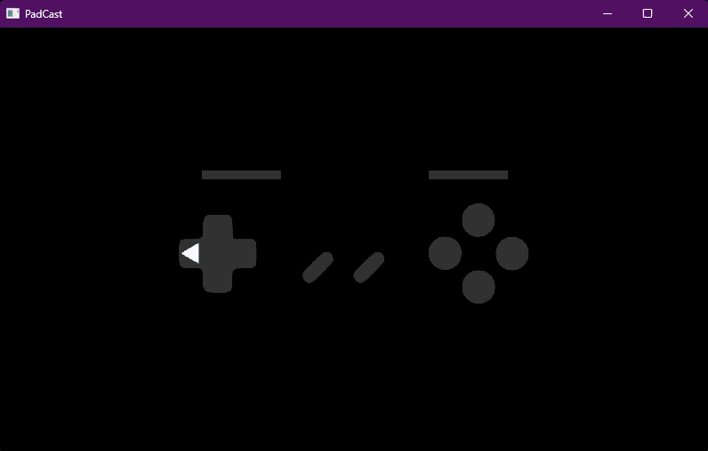

# PadCast
### A simple gamepad display that shows controller activity. Geared towards streamers.
---

Work in progress! So far supports (any?) controller that matches the configuration
you see in the image above.

Written in C++ and is light on resources.

The images are .png files under /resources/ and can be edited to change the appearance of
the controller in the program.

The program will keep the same resolution between uses.

---

### This is pre-release! (Warning)

Windows Defender will very likely flag this as a trojan (Wacatac) because it uses
statically-linked libraries that hook into DirectInput to capture gamepad inputs. It is
not a trojan. I'm working on how to compile this program to stop this false flag.

Also: Look through to TODO to see what hasn't been implemented and what is planned.

---

This project uses [raylib](https://github.com/raysan5/raylib), [raylib-cpp](https://github.com/RobLoach/raylib-cpp), 
and [mINI](https://github.com/metayeti/mINI) -- thank you for making this project possible!